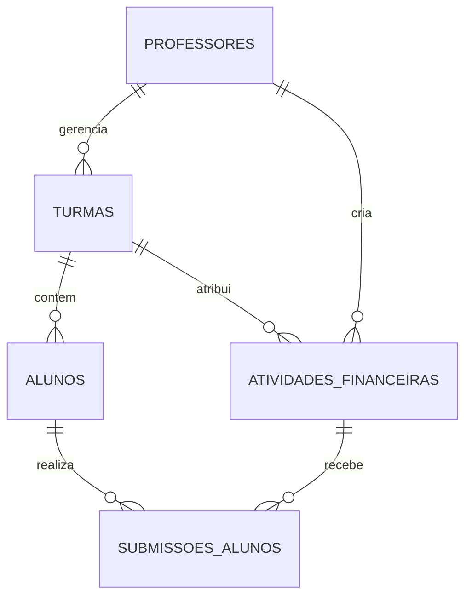

# Documento de Regras de Negócio — Finanças Integradas

## 1. Visão Geral do Projeto
O **Finanças Integradas** é uma plataforma educacional desenvolvida sob medida para instrutores e alunos do SENAI. O objetivo principal é proporcionar uma experiência prática de simulação financeira e rotinas de ERP em formato de planilha interativa (preenchimento linha a linha), cobrindo tópicos de matemática financeira, amortizações e gestão de custos empresariais.

---

## 2. Perfis de Usuários (Atores)

### 2.1. Professor / Instrutor
- Possui conta individual e autenticada no sistema.
- Gerencia suas próprias turmas, atividades e alunos de forma totalmente isolada de outros professores.
- Cria e parametriza atividades financeiras (enunciados, parâmetros de cálculo, gabarito e prazos).
- Acompanha o progresso e o preenchimento das atividades pelos alunos em tempo real.
- Visualiza métricas de aproveitamento e exporta notas e relatórios em formato compatível com planilhas (CSV / Google Sheets / Excel).

### 2.2. Aluno
- Acesso simples e desburocratizado: necessita apenas de **Nome Completo** e seleção ou código da **Turma**.
- Acessa as atividades financeiras ativas da sua turma.
- Realiza a simulação financeira preenchendo as tabelas **linha a linha** (período a período, lançamento a lançamento), reproduzindo a experiência de um ERP / planilha real.
- Pode salvar rascunhos e enviar a submissão final da atividade.
- Visualiza seu aproveitamento após a correção/entrega.

---

## 3. Módulos de Cálculos Financeiros Contemplados

O sistema oferece suporte a diferentes modelos matemáticos e simulações financeiras:

1. **Juros Simples e Compostos**:
   - Montante ($M$), Capital ($C$), Taxa ($i$), Tempo ($n$), Juros ($J$).
   - Evolução periódica do saldo devedor/investimento.
2. **Porcentagem e Variações Percentuais**:
   - Acréscimos, descontos sucessivos, margens sobre custo e venda.
3. **Custos Financeiros e Formação de Preço**:
   - Custos Fixos, Custos Variáveis, Ponto de Equilíbrio, Markup.
4. **Sistemas de Amortização**:
   - **Tabela SAC** (Sistema de Amortização Constante): Amortização fixa, juros decrescentes, prestações decrescentes.
   - **Tabela Price / Francês**: Prestações constantes, juros decrescentes, amortizações crescentes.
   - **Tabela SAM** (Sistema de Amortização Misto): Média aritmética entre SAC e Price.
5. **Modelos de Pagamento Especial**:
   - **Pagamento Único** (com ou sem carência).
   - **Pagamento Variável** / Fluxo de Caixa Livre.

---

## 4. Regras de Negócio e Fluxos Operacionais

### RN01 — Isolamento Multi-Professor (Multi-tenant)
- Cada professor possui seu próprio ambiente de dados.
- Um professor nunca poderá visualizar turmas, atividades, alunos ou submissões de outro professor.
- A segurança é garantida via autenticação e políticas de **Row Level Security (RLS)** no banco de dados.

### RN02 — Cadastro e Identificação do Aluno
- O aluno não necessita de cadastro complexo com senha caso o professor opte pelo acesso rápido.
- Dados mínimos obrigatórios do aluno: **Nome Completo** e vínculo com a **Turma**.

### RN03 — Criação e Parametrização de Atividades
- Ao criar uma atividade, o professor define:
  - Título e Enunciado com contexto prático do SENAI.
  - Tipo de Cálculo Financeiro.
  - Parâmetros Numéricos (Ex: Capital inicial, taxa de juros a.m./a.a., prazo/nº de parcelas, carência).
  - Estrutura da Planilha: colunas visíveis, colunas editáveis e colunas com fórmulas de apoio (opcional).
  - Tolerância de arredondamento (Ex: tolerância de $\pm$ R$ 0,05 para divergências comuns de casas decimais).

### RN04 — Simulação em Formato Planilha (Linha a Linha)
- A interface para o aluno apresenta uma grade interativa que simula um software ERP / Planilha eletrônica.
- O aluno preenche os campos linha a linha conforme calcula os períodos ($n=0, 1, 2, \dots$).
- O sistema permite salvar o progresso temporário (status: `em_andamento`) e realizar a entrega definitiva (status: `entregue`).

### RN05 — Cálculo Automático de Aproveitamento e Correção
- O sistema compara as linhas preenchidas pelo aluno com o gabarito gerado matematicamente pelo motor de cálculo.
- O percentual de aproveitamento (0% a 100%) é calculado pela proporção de células/linhas corretas dentro da margem de tolerância.
- O professor pode aceitar a nota automática calculada ou ajustar a nota manualmente, além de inserir feedbacks pedagógicos.

### RN06 — Exportação para Google Sheets / Excel
- O professor possui uma função dedicada para exportar o aproveitamento de uma turma inteira ou atividade específica.
- O arquivo gerado (CSV/XLSX) contém:
  - Nome do Aluno
  - Turma
  - Atividade
  - Percentual de Acerto / Aproveitamento (%)
  - Nota Final Atribuída
  - Data e Hora da Entrega
  - Status da Submissão

---

## 5. Estrutura de Dados Resumida

---

## 6. Critérios de Usabilidade e Acessibilidade
- Interface responsiva com design profissional e moderno.
- Feedback visual claro para o aluno durante o preenchimento (formatação automática de moeda R$, porcentagem %, separadores de milhares e decimais no padrão brasileiro).
- Atalhos de teclado amigáveis para navegação entre células (Enter, Tab, Setas direcionais) para agilizar o preenchimento.
